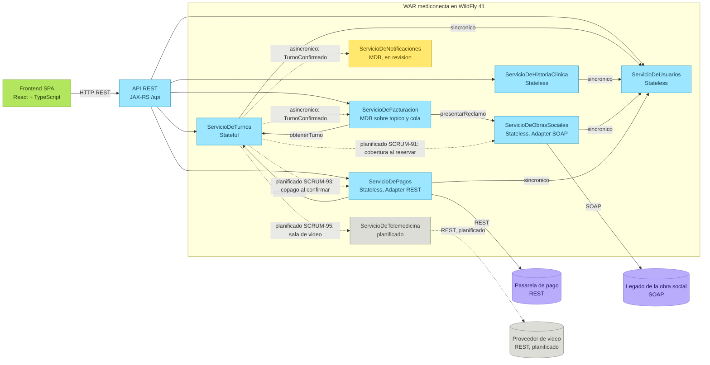
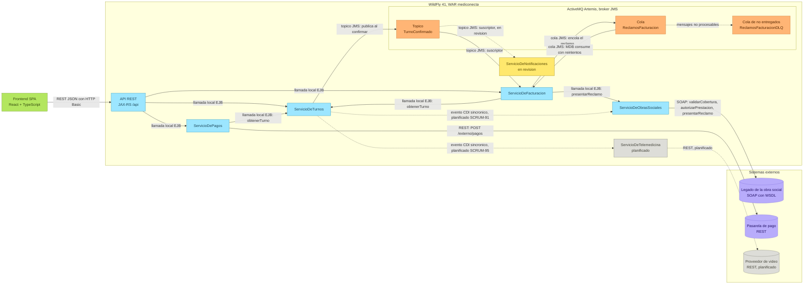

# MediConecta: diagramas de arquitectura

Versión editable en Miro: https://miro.com/app/board/uXjVEfW69Q0=/

Los dos diagramas de este archivo son la misma fuente Mermaid que está en el tablero, así que coinciden. GitHub los dibuja directamente.

**Convenciones.** Celeste: componente implementado y mergeado. Amarillo: en revisión (PR abierto). Gris: planificado. Violeta: sistema externo (simulado en el paquete `externos`). Naranja: destino JMS en Artemis. Línea continua: llamada sincrónica. Línea punteada: asincrónica (JMS) o planificada, según el rótulo.

## Arquitectura general: componentes y dependencias

Responde "quién llama a quién". Las dependencias sincrónicas son las que existen en el código: cada flecha es una llamada local a la fachada de otro componente, nunca a su DAO.

## Arquitectura de integración (SOA)

Responde "qué se conecta con qué y por qué canal". Cada conexión indica su canal: REST, SOAP, cola JMS, tópico JMS, llamada local EJB o evento CDI sincrónico. La justificación de cada elección está en la sección 4.1 del documento técnico.

